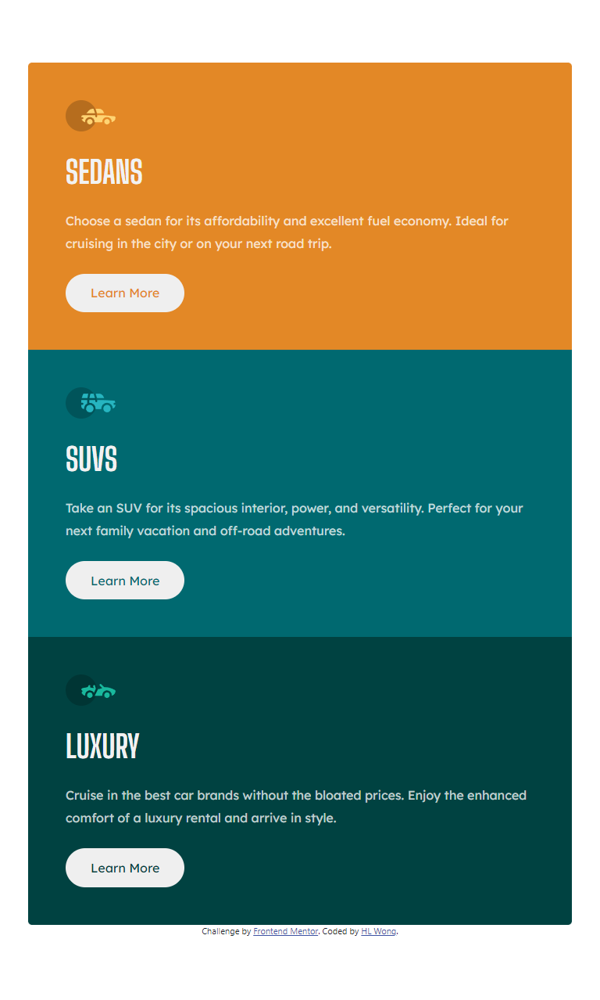

# Frontend Mentor - 3-column preview card component solution

This is a solution to the [3-column preview card component challenge on Frontend Mentor](https://www.frontendmentor.io/challenges/3column-preview-card-component-pH92eAR2-). Frontend Mentor challenges help you improve your coding skills by building realistic projects. 

## Table of contents

- [Overview](#overview)
  - [The challenge](#the-challenge)
  - [Screenshot](#screenshot)
  - [Links](#links)
- [My process](#my-process)
  - [Built with](#built-with)
  - [What I learned](#what-i-learned)
  - [Continued development](#continued-development)
- [Author](#author)

## Overview

### The challenge

Users should be able to:

- View the optimal layout depending on their device's screen size
- See hover states for interactive elements

### Screenshot

**Desktop**  

**Tablet**  

**Mobile**  

### Links

- Solution URL: [Solution](https://www.frontendmentor.io/solutions/3column-preview-card-component-z2o6OGwsBX)
- Live Site URL: [Live Site](https://dwz-wong.github.io/3-column-preview-card-component/)

## My process

### Built with

- Semantic HTML5 markup
- CSS custom properties
- Bootstrap
- Mobile-first workflow
- Flexbox
- Grid

### What I learned

I have learned and practiced using Bootstrap 5 on challenging Frontend Mentor project to improve my front-end development skills.

### Continued development

I will keep on challenging Frontend Mentor and other project to improve my front-end development skills to build a future project for my client and myself.

## Author

- DEV - [@dwz_wong](https://dev.to/dwz_wong)
- Frontend Mentor - [@dwz-wong](https://www.frontendmentor.io/profile/dwz-wong)
- Twitter - [@dwz_wong](https://twitter.com/dwz_wong)
